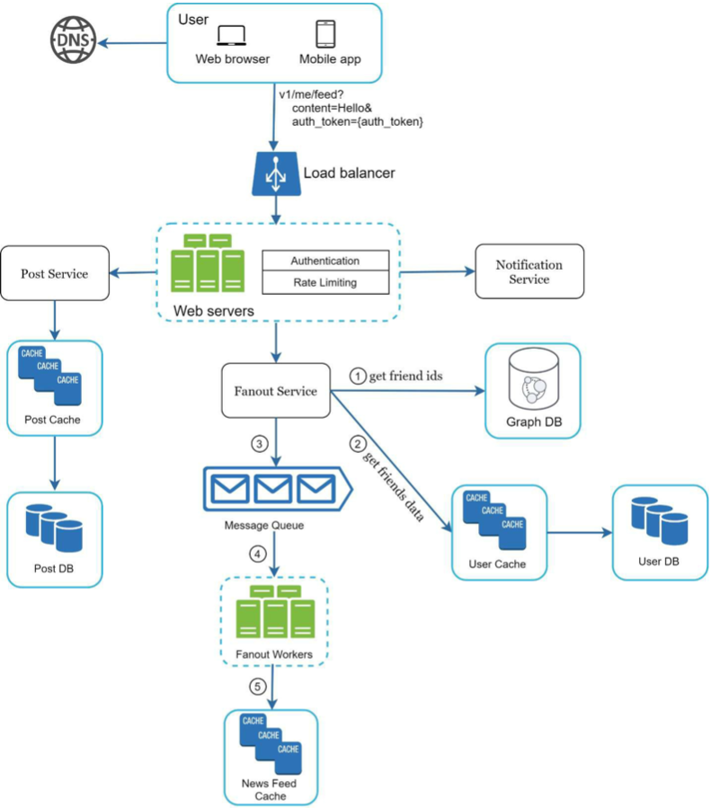
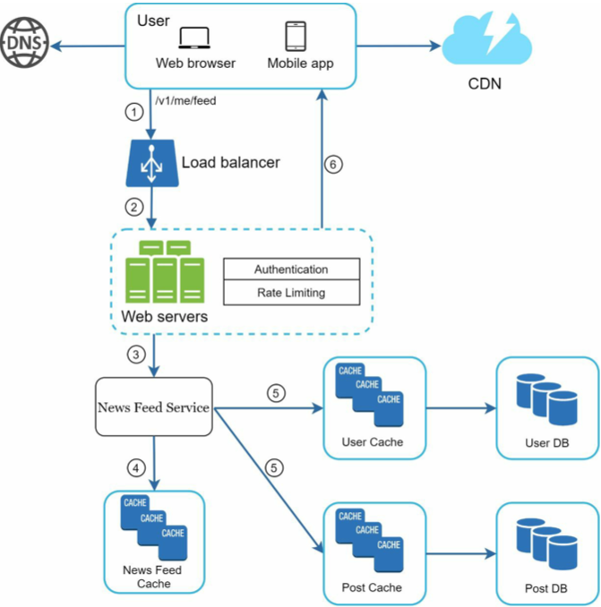

# Chapter 11: Design a News Feed System

> News Feed according to Facebook:
> - the constantly updating list of stories in the middle of your home page
> - includes status updates, photos, videos, links, app activity, and likes from people, pages and groups you follow on Facebook
> - similar questions: design Facebook newsfeed, instagram feed, twitter timeline, etc.

## Step 1: Understand the problem and establish design scope

Is this a mobile app? Or a web app? Or both?

- Both

What are the important features?

- a user can publish a post and see her friends' posts on the news feed page

Is the news feed sorted by reverse chronological order or any particular order such as topic scores? For instance, posts from your close friends have higher scores

- assume the feed is sorted by reverse chronological order
  - (the latest/most recent posts are at the top/show up first)

How many friends can a user have?

- 5000

What is the traffic volume?

- 10 million DAU

Can the feed contain images, videos, or just text?

- it can contain media files, including both images and videos

 

## Step 2: Propose high-level design and get buy-in

Two flows:

**Feed Publishing**
  - when a user publishes a post, corresponding data is written into cache and database
  - a post is populated to her friend's news feeds

**News Feed Buildling**
  - assume the news feed is built by aggregating friends' posts in reverse chronological order

### Newsfeed APIs
- HTTP-based
- allows clients to post a status, retrieve news feed, add friends, etc.

Two types:

**Feed publishing API**
> POST /v1/me/feed
>
> Params:
> - content: content is the text of the post.
> - auth_token: it is used to authenticate API requests.

**Newsfeed retrieval API**
> GET /v1/me/feed
>
> Params:
> - auth_token: it is used to authenticate API requests.

### Feed publishing

- a user can view news feeds through a browser or mobile app
  - they can make a post with content 'Hello' through API: `/v1/me/feed?content=Hello&auth_token={auth_token}`
- load balancer: distributes traffic to web servers
- web servers: redirect traffic to different internal services
- post service: persist post in the database and cache
- fanout service: push new content to friends' news feeds
  - newsfeed data is stored in the cache for fast retrieval
- notification service: inform friends that new content is available and send out push notifications

visual

 

### Newsfeed building

- user sends a request to retrieve their news feed
  - `/ v1/me/feed`
- load balancer: redirects traffic to web servers
- web servers: route requests to news feed service
- news feed service: fetches news feed from the cache
- news feed cache: stores news feed IDs needed to render the news feed

visual

 

## Step 3: Design deep dive

### Feed publishing deep dive

visual

 

**Web servers**
- besides communicating w clients, they enforce authentication and rate-limiting
  - only users signed in w valid `auth_token` are allowed to make posts
  - the system limits the number of posts a user can make w/in a certain period
    - vital to prevent spam and abusive content

**Fanout service**
- fanout: the process of delivering a post to all friends
- two types of fanout models: 
  - fanout on write (aka push model)
  - fanout on read (aka pull model)

*Fanout on write*
- news feed is pre-computed during write time
- a new post is delivered to friends' cache immediately after it's published

pros:
  - news feed is generated in real-time and can be pushed to friends immediately
  - fetching news feed is fast since it is pre-computed during write time

cons:
  - if a user has many friends, fetching the friend list and generating news feeds for all of them is slow and time consuming
    - the 'hotkey' problem
  - for inactive or those who rarely log in, pre-computing news feed wastes computing resources

*Fanout on read*
- new feed is generated during read time
- an on-demand model
- recent posts are pulled when a user loads her home page

pros:
  - for inactive or those who rarely log in, fanout on read is better since it won't waste computing resources on them
  - data isn't pushed to friends so there is no hotkey problem

cons:
  - fetching the news feed is slow since it isn't pre-computed

To get benefits of both, we can use a hybrid approach.
- since fetching the news feed fast is crucial, we use push model for majority of users
- for celebs or users who have many friends/followers, we let followers pull news content on-demand to avoid system overload
- consistent hashing is a useful technique to mitigate the hotkey problem
  - helps distribute requests/data more evenly

How the fanout service works:
1. fetch friend IDs from the graph DB
    - graph DBs are suited for managing friend relationship and friend recommendations
2. get friends info from the user cache
    - system filters out friends based on user settings
      - for ex. if you mute someone, their posts won't show up on your news feed even though you're still friends
      - for ex. a user could selectively share info w specific friends or hide it from other people
3. send friends list and new post ID to the message queue
4. fanout workers fetch data from the message queue and store news feed data in the news feed cache
    - can think of the news feed cache as a `<post_id, user_id>` mapping table
    - whenever a new post is made, it will be appended to the news feed table (see table below)
    - memory consumption can become v large if we store the entire user and post objects in the cache
      - thus, only IDs are stored
    - to keep memory size small, we set a configurable limit
    - the chance of a user scrolling through thousands of posts in news feed is slim
      - most users are only interested in the latest content, so the cache miss rate is low
5. store `<post_id, user_id>` in news feed cache

news feed table

 

### Newsfeed retrieval deep dive

visual

 

- media content (images, videos, etc) are stored in CDN for fast retrieval

How a client retrieves news feed:
1. a user sends a request to retrieve her news feed
   - `/v1/me/feed`
2. load balancer: redistributes requests to web servers
3. web servers call the news feed service to fetch news feeds
4. news feed service gets a list of post IDs from the news feed cache
5. a user's news feed also contains username, profile picture, post content, post image, etc
    - the news feed service fetches the complete user and post objects from caches to construct the fully hydrated news feed
6. fully hydrated news feed is returned in JSON format back to the client for rendering

### Cache architecture
- cache is crucial for a news feed system
- we divide the cache tier into 5 layers
1. news feed: stores IDs of news feeds
2. content: stores every post data
    - popular content is stored in hot cache
3. social graph: stores user relationship data
4. action: stores info about whether a user liked a post, replied to a post, took other actions on a post
5. counters: stores counters for likes, replies, followers, following, etc.

Cache tiers

 

## Step 4: Wrap up

### Scaling the database:
- vertical scaling vs horizontal scaling
- SQL vs NoSQL
- master-slave replication (primary/replicas)
- read replicas
- consistency models
- database sharding

### Other talking points:
- keep web tier statless
- cache data as much as you can
- support multiple data centers
- lose couple components w message queues
- monitor key metrics
  - QPS during peak hours
  - latency while users refreshing their news feed