# Chapter 15: Design Google Drive

> Background:
>
> Google Drive is a file storage and synchronization service that helps you store documents, photos, videos, and other files in the cloud.
> - can access your files from any computer, smartphone, and tablet
> - can share those files w friends, family and coworkers
>
> Other cloud storage services: Dropbox, Microsoft OneDrive, Apple iCloud

## Step 1: Understand the problem and establish design scope

What are the most important features?

- Upload and download files, file sync, and notifications

Is this a mobile app, a web app, or both?

- Both

What are supported file formats?

- Any file type

Do files need to be encrypted?

- Yes, files in the storage must be encrypted

Is there a file size limit?

- Yes, files must be 10GB or smaller

How many users does the product have?

- 10M DAU

 

### Features we focus on: 
- Add files
  - drag and drop a file into Google Drive
- Download files
- Sync files across multiple devices
  - when a file is added to one device, it's automatically synced to other devices
- See file revisions
- Share files w friends, family, and coworkers
- Send a notification when a file is edited, deleted, or shared w you

* Out of scope: google doc editing and collaboration
  - google doc allows multiple people to edit the same doc at the same time

**Non-functional requirements**
- Reliability
  - data loss is unacceptable
- Fast sync speed
  - if file sync takes too much time, users will become impatient and abandon the product
- Bandwidth usage
  - if product takes a lot of unnecessary network bandwidth, users will be unhappy, esp when they are on a mobile data plan
- Scalability
  - system should be able to handle high volumes of traffic
- High availability
  - users should still be able to use the system when some servers are offline, slowed down, or have unexpected network errors

## Back of the envelope estimation
- assume the app has 50M signed up users and 10M DAU
- users get 10GB free space
- assume users upload 2 files per day
  - avg file size is 500KB
- 1:1 read to write ratio
- total space allocated: 50M * 10GB = 500 petabytes
- QPS for upload API: 10M * 2uploads / 24hrs / 3600secs = ~ 240QPS
- Peak QPS = QPS * 2 = 480

## Step 2: Propose high-level design and get buy-in
> we'll start with building everything in a single server, then gradually scale up to support millions of users

single server setup:
 - a web server to upload and download files
 - a database to keep track of metadata like user data, login info, files info, etc.
 - a storage system to store files; we allocate 1TB of storage space to store files

- an apache web server, a mysql database, and a directory called *`drive/`*
  - under the *`drive/`* directory is a list of directories known as **namespaces**
    - each namespace contains all the uploaded files for that user
    - the filename on the server is kept the same as the original filename
    - each file or folder can be uniquely identified by joining the namespace and the relative path
  - 
 
example view

    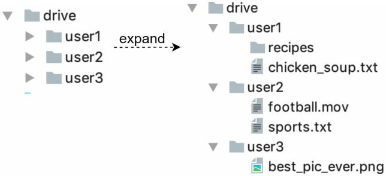
    

 
### APIs
3 primary APIs: upload a file, download a file, and get file revisions

1. **Upload a file to Google Drive**
  - two types of uploads are supported:
    - **simple upload**: 
      - use when the file size is small
    - **resumable upload**: 
      - use when the file size is large and there is high chance of network interruption
      - example: `https://api.example.com/files/upload?uploadType=resumable`
        - params: 
          - uploadType=resumable
          - data: local file to be uploaded
      - achieved by the following 3 steps:
        - send the initial request to retrieve the resumable URL
        - upload the data and monitor upload state
        - if upload is disturbed, resume the upload
2. **Download a file from Google Drive**
  - example: `https://api.example.com/files/download`
    - params:
      - path: download file path
        - ex: `{ "path": "/recipes/soup/best_soup.txt" }`

3. **Get file revisions**
  - example: `https://api.example.com/files/list_revisions`
    - params:
      - path: path to the file you want to get the revision history
      - limit: the max number of revisions to return
      - ex: `{ "path": "/recipes/soup/best_soup.txt", "limit": 20 }`

All the APIs require user authentication and use HTTPS. Secure Sockets Layer (SSL) protects data transfer between the client and backend servers.

### Move away from single server
- as more files are uploaded, eventually you get the space full alert
  - users cannot upload files anymore
- first solution is to shard the data, so it's stored on multiple storage servers
- 

example sharding based on `user_id`

  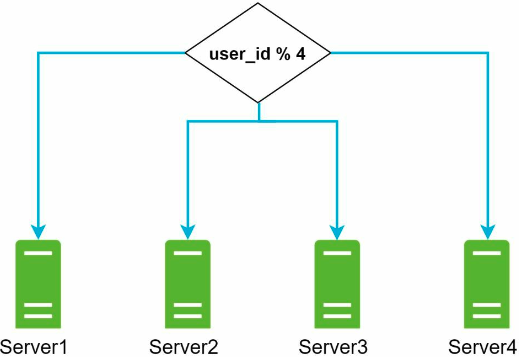
  

- to help avoid potential data losses in case of storage server outage you put the files into AWS S3
  - S3 supports same-region and cross-region replication
    - region is a geographic area where AWS has data centers
    - redundant files are stored in multiple regions to guard against data loss and ensure availability
    - a bucket is like a folder in file systems
    - 

example

      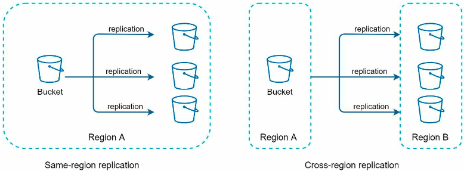
      

- other areas you can improve:
  - load balancer: add a load balancer to distribute network traffic
    - ensure evenly distributed traffic and if a web server goes down, it will redistribute traffic
  - web servers: after adding a LB, more web servers can be added/removed easily, depending on traffic load
  - metadata database: move the database out of the server to avoid SPOF
    - in the meantime, set up data replication and sharding to meet the availability and scalability requirements
  - file storage: S3 is used for file storage
    - files are replicated in two separate geographical regions to ensure availability and durability
- once applying the above improvements, the web servers, metadata database, and file storeage are decouple from a single server
  - 

updated design

    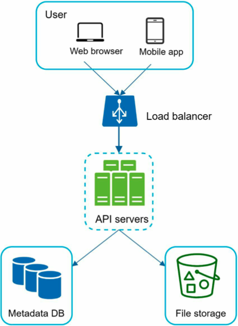
    

### Sync conflicts
> when two users modify the same file or folder at the same time, a conflict happens
- one strategy: the first version that gets processed wins, and the version that gets processed later receives a conflict
- example of a conflict:
  - user 1 and user 2 try to update the same file at the same time, but user 1's file is processed by our system first
  - user 1's update operation goes through, but user 2 gets a sync conflict
  - our system presents both copies of the same file: user 2's copy and the latest version from the server
  - user 2 has the option to merge both files or override one version w the other
  - 

visuals

    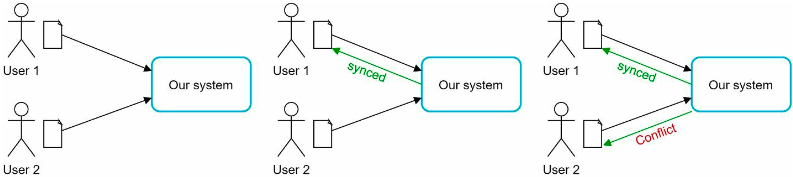
    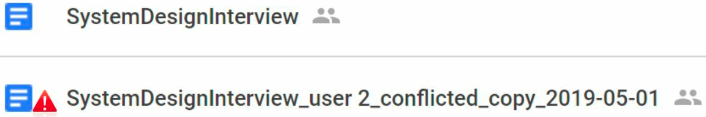
    

### High-level design
- 

high-level design diagram

  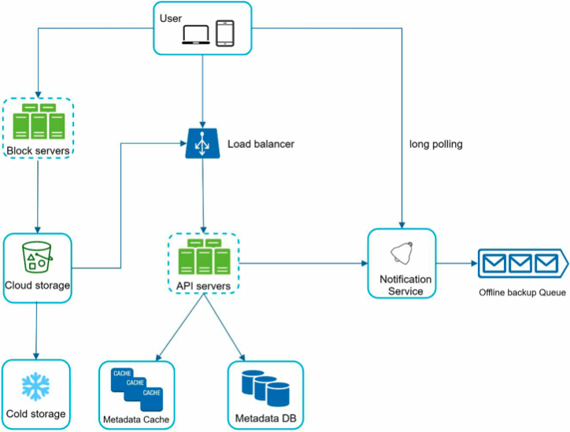
  

- **user**: uses the application either through a browser or mobile app
- **block servers**: upload blocks to cloud storage
  - block storage (block-level storage) is a technology to store data files on cloud-based environments
  - a file can be split into several blocks, each w a unique hash value, stored in our metadata db
  - each block is treated as an independent object and stored in our storage system
  - to reconstruct a file, blocks are joined in a particular order
  - we use Dropbox as a reference for the block size: it sets the max size of a block to 4MB
- **cloud storage**: a file is split into smaller blocks and stored in cloud storage
- **cold storage**: a computer system designed for storing inactive data meaning files aren't accessed for a long time
- **load balancer**: evenly distributes requests among API servers
- **API servers**: responsible for almost everything other than uploading flow
  - used for user authentication, managing user profile, updating file metadata, etc.
- **metadata database**: stores metadata of users, files, blocks, versions, etc.
  - note that files are stored in the cloud and the metadata database only contains metadata
- **metadata cache**: some of the metadata are cached for fast retrieval
- **notification service**: it is a publisher/subscriber system that allows data to be transferred from notification service to clients as certain events happen
  - in this use case, notification service notifies relevant clients when a file is added/edited/removed elsewhere so they can pull the latest changes
- **offline backup queue**: if a client is offline and cannot pull the latest changes, the offline backup queue stores the info so changes will be synced when the client is online

## Step 3: Design deep dive
### Block servers
- for large files that are updated regularly, sending the whole file on each update consumes a lot of bandwidth
- two optimizations to minimize amount of network traffic being transmitted:
  - Delta sync
    - when a file is modified, only modified blocks are synced instead of the whole file using a sync algorithm
  - Compression
    - applying compression on blocks can significantly reduce the data size
    - blocks are compressed using compression algorithms depending on file types
      - ex: gzip and bzip2 are used to compress text files
    - different compression algos are needed to compress images and videos

- block servers do the heavy lifting work for uploading files
  - the process files passed from clients by splitting a file into blocks, compressing each block, and encrypting them
  - instead of uploading the whole file to the storage system, only modified blocks are transferred

- when a new file is added:
  - 

visual process

      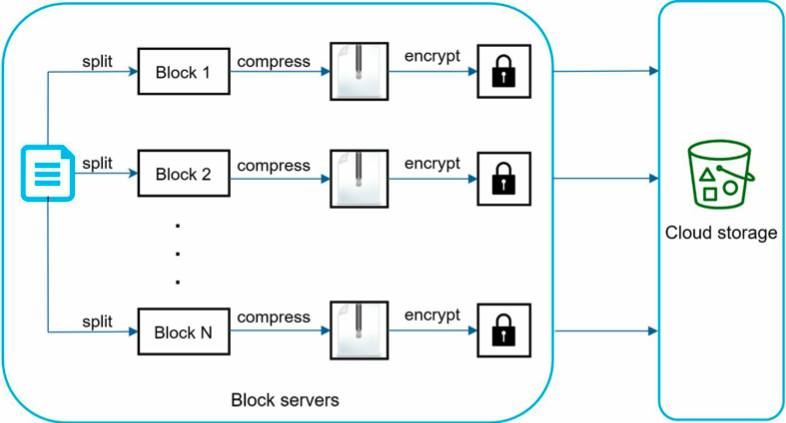
    

  - a file is split into smaller blocks
  - each block is compressed using compression algos
  - to ensure security, each block is encrypted before it's sent to cloud storage
  - blocks are uploaded to the cloud storage

- only modified blocks are transferred to cloud storage
  - 

delta sync

      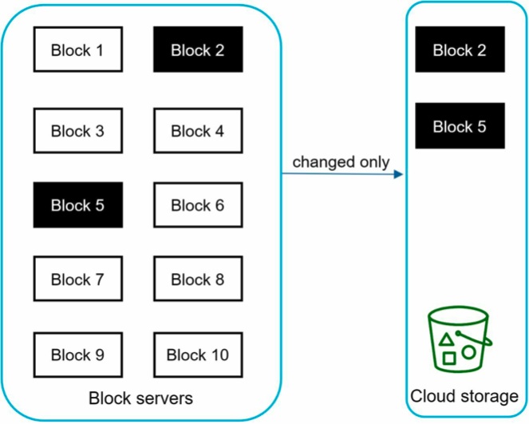
    

  - block 2 and block 5 are changed blocks, only those two are uploaded to the cloud storage
  - block servers saves network traffic by providing delta sync and compression

### High consistency requirement
- it's unacceptable for a file to be shown differently by different clients at the same time
- the system needs to provide strong consistency for metadata cache and database layers
- memory caches adopt an eventual consistency model by default
  - different replicas might have different data
  - to ensure strong consistency:
    - data in cache replicas and the master is consistent
    - invalidate caches on db write to ensure cache and db hold the same value
- strong consistency in a relational db is easy bc it maintains ACID properties (Atomicity, Consistency, Isolation, Durability) by default
- in NoSQL dbs, ACID properties must be programmatically incorporated in synchronization logic
- our design chooses relational dbs since ACID is natively supported

### Metadata database
- 

simplified database schema design

    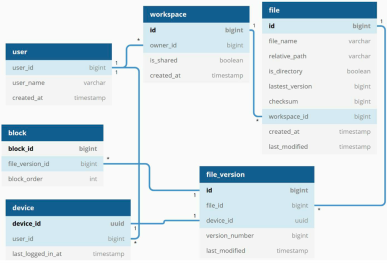
  

- user: the user table contains basic info about the user such as username, email, profile photo, etc
- device: device table stores device info
  - `push_id` is used for sending and receiving mobile push notifications
  - note that a user can have multiple devices
- namespace: a namespace is the root directory of a user
- file: file table stores everything related to the latest file
- file_version: stores version history of a file
  - existing rows are read-only to keep the integrity of the file revision history
- block: stores everything related to a file block
  - a file of any version can be reconstructed by joining all the blocks in the correct order

### Upload flow
- 

sequence diagram

    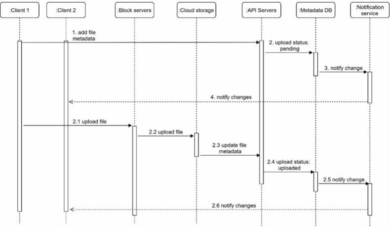
  

- two requests are send in parallel, originating from client 1:
  - add file metadata
  - upload the file to cloud storage

**Add file metadata**

  1\. client 1 sends a request to add the metadata of the new file

  2\. store the new file metadata in metadata DB and change the file upload status to "pending"

  3\. notify the notification service that a new file is being added

  4\. the notification service notifies relevant clients (client 2) that a file is being uploaded

**Upload files to cloud storage**

  2.1. client 1 uploads the content of the file to block servers

  2.2 block servers chunk the files into blocks, compress, encrypt the blocks, and upload them to cloud storage

  2.3 once the file is uploaded, cloud storage triggers upload completion callback
    - the request is sent to API servers

  2.4 file status changed to "uploaded" in metadata db

  2.5 notify the notification service that a file status is changed to "uploaded"

  2.6 the notification service notifies relevant clients (client 2) that a file is fully uploaded

> When a file is edited, the flow is similar to the above

### Download flow
- triggered when a file is added or edited elsewhere
- there are two ways a client can know a file is added or edited by another
  - if client A is *online* while a file is changed by another client, notification service will inform client A that changes are made somewhere so it needs to pull the latest data
  - if client A is *offline* while a file is changed by another client, data will be saved to the cache
    - when the client is online again, it pulls the latest changes

- once a client knows a file is changed, it first requests metadata via API servers, then downloads blocks to construct the file
- 

sequence diagram

    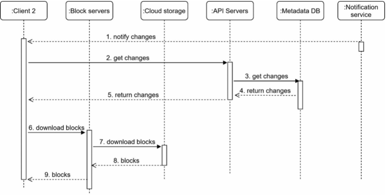
  

  1. notification service informs client 2 that a file is changed elsewhere
  2. once client 2 knows that new updates are available, it sends a request to fetch metadata
  3. API servers call metadata db to fetch metadata of the changes
  4. metadata is returned to the API servers
  5. client 2 gets the metadata
  6. once the client receives the metadata, it sends requests to block servers to download blocks
  7. block servers first download blocks from cloud storage
  8. cloud storage returns blocks to the block servers
  9. client 2 downloads all the new blocks to reconstruct the file

### Notification service
- to maintain file consistency, any mutation of a file performed locally needs to be informed to other clients to reduce conflicts
  - notification service is built for this purpose
- at a high-level, notification service allows data to be transferred to clients as events happen; some options:
  - long polling (dropbox uses long polling)
  - websocket: provides a persistent connection between the client and the server; communication is bi-directional
- our design opts for long polling for two reasons:
  - communication for notification service is not bi-directional
    - the server sends info about file changes to the client, but not vice versa
  - websocket is suited for real-time bi-directional communication such as a chat app; for Google Drive, notifications are sent infrequently with no burst of data

- each client establishes a long poll connection to the notification service
  - if changes are detected, the client will close the long poll connection
  - closing the connection means a client must connect to the metadata server to download the latest changes
  - after a response is received or connection timeout is reached, a client immediately sends a new request to keep the connection open

### Save storage space
- multiple versions of the same file are stored across multiple data centers to ensure reliability
- storage space can be filled quickly w frequent backups of all file revisions; three techniques to reduce storage costs:
  - de-duplicate data blocks
    - eliminating redundant blocks at the acct level
    - two blocks are identical if they have the same hash value
  - adopt an intelligent data backup strategy; two optimization strategies:
    - set a limit: set a limit for the number of versions to store
      - if the limit is reached, the oldest version will be replaced w the new one
    - keep valuable versions only: some files might be edited frequently
      - ex: saving every edited version for a heavily modified doc could mean the file is saved over 1000 times w/in a short period
      - to avoid unnecessary copies, limit the number of saved versions
      - give more weight to recent versions
      - experimentation is helpful to figure out the optimal numver of versions to save
  - moving infrequently used data to cold storage
    - cold data is data that hasn't been active for months or years
      - ex: cold storage like amazon s3 glacier is cheaper than s3

### Failure handling
- load balancer failure:
  - if a LB fails, the secondary would become active and pick up the traffic
  - LBs usually monitor each other using a heartbeat (periodic signal sent between LBs)
  - an LB is considered as failed if it hasn't sent a heartbeat for some time
- block server failure:
  - if a block server fails, other servers pick up unfinished/pending jobs
- cloud storage failure:
  - s3 buckets are replicated multiple times in diff regions
    - if files aren't available in one region, they can be fetched from diff regions
- API server failure:
  - it's a stateless service
  - if an API server fails, the traffic is redirected to other API servers by a LB
- metadata cache failure:
  - metadata cache servers are replicated multiple times
  - if one node goes down, you can access other nodes to fetch data
  - bring up a new cache server to replace the failed one
- metadata DB failure:
  - master down: promote on of the slaves to act as a new master and bring up a new slave node
  - slave down: use another slave for read operations and bring another database server to replace the failed one
- notification service failure:
  - every online user keeps a long poll connection w the notification server; each notification server is connected w many users
    - ex: dropbox - over 1M connection are open per machine
  - if a server goes down, all the long poll connections are lost so clients must reconnect to a different server
  - even though one server can keep many open connections, it can't reconnect all the lost connections at once
  - reconnecting w all the lost clients will be a slow process
- offline backup queue failure:
  - queues are replicated multiple times
  - if one queue fails, consumers of the queue may need to re-subscribe to the backup queue

## Step 4: Wrap up
- two flows: 
  - manage fiile metadata
  - file sync
- notification service
  - uses long polling to keep clients up to date w file changes

Different design choices
- upload files directly to cloud storage from the client instead of going through block servers
  - advantage: 
    - it makes file upload faster bc a file only needs to be transferred once to the cloud storage (current design goes through block servers first then to cloud storage)
  - drawbacks: 
    - the same chunking, compression, and encryption logic must be implemented on different platforms (iOS, android, web)
      - error-prone and requires a lot of engineering effort
      - (current design, all that logic is implemented within a centralized place block servers)
    - since a client can be easily hacked or manipulated, implementing encrypting logic on the client side is not ideal
- moving online/offline logic to a separate service (presence service)
  - by moving this out of notification servers, online/offline functionality can easily be integrated by other services
