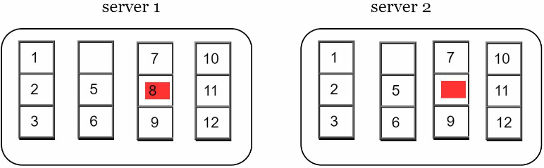

# Chapter 6: Design a Key-Value Store
> Design a key-value store that supports the following operations:
> - put(key, value) // insert 'value' associated with 'key'
> - get(key) // get 'value' associated with 'key'
>
> and has the following characteristics:
> - the size of a key-value pair is small: less than 10KB
> - ability to store big data
> - high availability: the system responds quickly, even during failures
> - high scalability: the system can be scaled to support large data sets
> - automatic scaling: addition/deletion of servers should be automatic based on traffic
> - tunable consistency
> - low latency

Key-value store:
- aka key-value database
- a non-relational database
- key must be unique and value associated w the key can be accessed through the key
- keys can be plain text (“last_logged_in_at”) or hashed values (253DDEC4)
  - for performance reasons, a short key works better
- values can be strings, lists, objects, etc

## Single server key-value store
- an intuitive approach is to store key-value pairs in a hash table, which keeps everything in memory
- even though memory access is fast, fitting everthing in memory may be impossible due to the space constraint
- two optimizations to fit data in a single server:
  - data compression
  - store only frequently used data in memory and the rest on disk
  - but even with these optimizations, a single server can reach its capacity quickly -> a distributed k/v store is required to support big data

## Distributed key-value store
- aka a distributed hash table
  - distributes k/v pairs across many servers
- when designing a distributed system, keep the CAP theorem in mind

### CAP Theorem
- states that it's impossible for a distributed system to provide more than 2 out of 3 of the guarantees:

**Consistency**
- all clients see the same data at the same time no matter which node they connect to

**Availability**
- any client which requests data gets a response even if some of the nodes are down

**Partition Tolerance**
- a partition indicates a communication break between two nodes
- the system continues to operate despite network partitions

Key-value stores can be classified based on two CAP characteristics they support:

**CP systems**: supports consistency and partition tolerance while sacrificing availability

**AP systems**: supports availability and partition tolerance while sacrificing consistency

**CA systems**: supports consistency and availability while sacrificing partition tolerance
  - since network failure is unavoidable, a distributed system *must* tolerate network partition
    - a CA system can't exist in real-world apps

### Understand your use case
- choose the right CAP guarantees to fit your use case

Examples with 3 replica nodes:

**Ideal situation:**
- network partition never occurs
- data written to n1 is automatically replicated to n2 and n3
- both consistency and availability are achieved

**Real-world distributed systems**
- partitions can't be avoided
  - we must choose between consistency and availability

Example:
  - If n3 goes down and can't communicate with n1 and n2
  - client data written to n1 or n2 can't be propagated to n3
  - if data is written  to n3 but not propagated to n1 and n2 yet, n1 and n2 would have stale data

If we choose a CP system:
- must block all write operations to n1 and n2 to avoid data inconsistency; making the system unavailable
- banks usually have high consistency requirements
  - crucial for a bank system to display the most up-to-date balance info
  - if inconsistency occurs due to network partition, bank system returns an error before the inconsistency is resolved

If we choose an AP system:
- keep accepting reads even if the data may be stale
- n1 and n2 will accepts writes and data will be synced to n3 when network partition is resolved

## System Components
Core components and techniques used to build a k/v store; mostly based on three popular k/v store systems (Dynamo, Cassandra, and BigTable):

Data partition

- for large apps, it's infeasible to fit the complete data set into a single server
- split data into smaller partitions and store them in multiple servers
- two challenges:
  - distribute data across multiple servers evenly
  - minimize data movement when nodes are added or removed
- **consistent hashing** is a technique to solve these problems
  - servers are placed on a hash ring
  - next, a key is hashed onto the same ring and is stored on the first server encountered while moving in the clockwise direction; for ex. key0 is stored in s1 using this logic:
  
  - advantages of using consistent hashing to partition data:
    - **automatic scaling**: servers could be added and removed automatically depending on the load
    - **heterogeneity**: the number of virtual nodes for a server is proportional to the server capacity
      - for ex. servers with higher capacity are assigned w more virtual nodes

Data replication

- to achieve high availability and reliability, data must be replicated asynchronously over *N* servers, where *N* is a configurable parameter
- these *N* servers are chosen by:
  - after a key is mapped to a position on the hash ring, walk clockwise from that position and choose the first *N* servers on the ring to store data copies
- For ex. *N* = 3, key0 is replicated at s1, s2, and s3:
  
- with virtual nodes, the first *N* nodes on the ring may be owned by fewer than *N* physical servers
  - to avoid this issue, only choose unique servers while performing the clockwise walk logic
- nodes in the same data center often fail at the same time due to power outages, network issues, natural disasters, etc.
- for better reliability, replicas are placed in distinct data centers, and data centers are connected through high-speed networks

Consistency

- since data is replicated at multiple nodes, it must be synchronized acorss replicas
- quorum consensus can guarantee consitency for both read/write operations

Definitions:
- *N*: number of replicas
- *W*: a write quorom of size *W*
  - for a write to be considered as successful, write operation must be acknowledged from *W* replicas
- *R*: a read quorum of size *R*
  - for a read to be successful, read operation must wait for responses from at least *R* replicas

*N* = 3

- *W* = 1 doesn't mean data is written on one server
  - in the above, data is replicated at s0, s1, and s2
  - *W* = 1 means the coordinator must receive at least one acknowledgement before the write operation is considered successful
    - if we get an ack from s1, we no longer need to wait for acks from s0 and s2
    - a coordinator acts as a proxy between the client and the nodes
- the configuration of *W*, *R*, and *N* is a typical tradeoff between latency and consistency
  - if *W* = 1 or *R* = 1, an operation is returned quickly bc a coordinator only  need to wait for a reponse from any of the replicas
  - if *W* or *R* > 1, the system offers better consistency
    - but query will be slower bc coordinator must wait for the response from the slowest replica
- if *W* + *R* > *N*, strong consistency is guaranteed bc there must be at least one overlapping node that has the latest data to ensure consistency

How to configure *N*, *W*, and *R* to fit our use cases?
Some possible setups:
- if *R* = 1 and *W* = *N* -> fast reads
- if *W* = 1 and *R* = *N* -> fast writes
- if *W* + *R* > *N*, strong consistency is guaranteed (usually *N* = 3, *W* = *R* = 2)
- if *W* + *R* <= *N*, strong consistency is NOT guaranteed 

**Consistency models**
- defines the degree of consistency
spectrum of possible consistency models:
- **strong consistency**: 
  - any read operation returns a value corresponding to the result of the most updated write data item
  - a client never sees out-of-date data
  - usually achieved by forcing a replica not to accept new reads/writes until every replica has agreed on current write
  - not ideal for highly available systems
    - could block new operations
- **weak consistency**:
  - subsequent read operations may not see the most updated value
- **eventual consistency**: 
  - specific form of weak consistency
  - given enough time, all updates are propagated, and all replicas are consistent
  - recommended consistency model for our k/v store
    - examples: Dynamo and Cassandra
  - from concurrent writes, eventual consistency allows inconsistent values to enter the system and force the client to read the values to reconcile

Inconsistency resolution: versioning

- versioning and vector clocks are used to solve inconsistency problems
- versioning means treating each data modification as a new immutable version of data

Example of how inconsistency happens:
- n1 and n2 have the same values
- server1 and server2 get the same value for `get("name")`

- server1 changes the name to 'johnSanFrancisco' and server2 changes the name to 'johnNewYork' at the same time
- now there are conflicting values, called versions v1 and v2

- no clear way to resolve the conflict of the last two versions
- we need a versioning system that can detect conflicts and reconcile conflicts
  - a vector clock is a common technique used

Vector clock
- a [server, version] pair associated w a data item
- can be used to check if one version precedes, succeeds or is in conflict w others

- assume a vector clock is represented by D([S1, v1], [S2, v2], ..., [Sn, vn]), where D is a data item,v1 is a version counter, and s1 is a server number
  - if data item D is written to server Si, the system must perform one of the following tasks
    - increment vi if [Si, vi] exists
    - else, create a new entry [Si, 1]
- for ex:

  1. a client writes a data item D1 to the system, and the write is handled by server Sx, which now has the vector clock D1[(Sx, 1)]
  2. another client reads the latest D1, updates it to D2 and writes it back
    - D2 descends from D1 do it overwrites D1
    - assume the write is handled by the same server Sx, which now has vector vlock D2[(Sx, 2)]
  3. another client reads the latest D2, updates it to D3, and writes it back
    - assume the write is hanlded by server Sy, which now has vector clock D3([Sx, 2], [Sy, 1])
  4. another client reads the latest D2, updates it to D4, and writes it back
    - assume the write is handled by server Sz, which now has D4([Sx, 2], [Sz, 1])
  5. when another client reads D3 and D4, it discovers a conflict, which is caused by data item D2 being modified by both Sy and Sz
    - the conflict is resolved by the client and updated data is sent to the server
    - assume the write is handled by Sx, which now has D5([Sx, 3], [Sy, 1], [Sz, 1])

- using vector clocks, it's easy to tell that a version X is an ancestor (no conflict) of version Y if the version counters for each participant in the vector block of Y is greater than or equal to the ones in version X
  - for ex. D([s0, 1], [s1, 1]) is an ancestor of D([s0, 2], [s1, 1])
- two downsides:
  - adds complexity to the client bc it needs to implement conflict resolution logic
  - [server: version] pairs in the vector clock could grow rapidly
    - to fix, we can set a threshold for length, and if exceeded, the oldest pairs are removed
      - this can lead to inefficiencies in reconciliation bc the descendant relationship can't be determined accurately

Handling failures

**Failure detection**
- insufficient to believe a server is down bc another server says so
  - usually requires at least two independent sources of info to mark a server is down

- all-to-all multicasting is a straightforward solution, but inefficient when many servers are in the system

- a better solution is to use decentralized failure detection methods like **gossip protocol**:
  - each node maintains a node membership list, which contains member IDs and heartbeat counters
  - each node periodically increments its heartbeat counter
  - each noe periodically sends heartbeats to a set of random nodes, which is return propagate to another set of nodes
  - once nodes receive heartbeats, membership list is updated to latest info
  - if the heartbeat has not increased for more than predefined periods, the member is considered offline
Example:

- node s0 maintains a node membership list shown on the left side
- node s0 notices that node s2's (memberID = 2) heartbeat counter has not increased for a long time
- node s0 sends heartbeats that includes s2's info to a set of random nodes
  - once other nodes confirm that s2's heartbeat counter hasn't been updated for a long time, node s2 is marked down, and this info is propagated to other nodes

**Handling temporary failures**
- a technique called 'sloppy quorum' is used to improve availability 
- instead of enforcing the quorum requirement, the system chooses the first W healthy servers for writes and first R healthy servers for reads on the hash ring
  - offline servers are ignored
- if a server is down, another server will process requests temporarily
  - when the down server is up, changes will be pushed back to achieve data consistency
  - this process is called 'hinted handoff' 
  - since s2 is unavailable, reads/writes will be handled by s3 temporarily, when s2 is back online, s3 will hand the data back to s2:
  

**Handling permanent failures**
- what is a replica is permanently down?
  - implement an anti-entropy protocol to keep replicas in sync
  - anti-entropy involves comparing each piece of data on replicas and updating each replica to the newest version
  - a Merkle tree is used for inconsistency detection and minimizing the amount of data transferred
    - “A hash tree or Merkle tree is a tree in which every non-leaf node is labeled with the hash of the labels or values (in case of leaves) of its child nodes. Hash trees allow efficient and secure verification of the contents of large data structures”

Steps to create a Merkle tree; assuming key space is from 1-12; highlighted boxes indicate inconsistency

Step 1: Divide key space into buckets (4 in our ex); a bucket is used as the root level node to maintain a limited depth of the tree
  

Step 2: Once the buckets are created, hash each key in a bucket using a uniform hashing method
  

Step 3: Create a single hash node per bucket
  

Step 4: Build the tree upwards till root by calculating hashes of children
  

- to compare two Merkle trees, start comparing the root hashes
  - if they match, both servers have the same data
  - if the root hashes disagree, then the left child hashes are compared, then the right child hashes
  - you can traverse the tree to find which buckets are not synchronized and synchronise those buckets only

- using Merkle trees, the amount of data needed to be synced is proportional to the differences between the two replicas, and not the amount of data they contain
  - in real-world systems, the bucket size is big
    - for ex. a possible configuration is 1 mil buckets per 1 bil keys, so each bucket contains 1000 keys

**Handling data center outage**
- replicate data across multiple data centers
- even if a data center is completely down, users can still access data through the other data center

System architecture diagram

Main features:
  - clients communicate w the k/v store through simple APIs: `get(key)` and `put(key, value)`
  - coordinator is a node that acts as a proxy between the client and k/v store
  - nodes are distributed on a ring using consistent hashing
  - the system is completely decentralized so adding and moving nodes can be automatic
  - data is replicated at multiple nodes
  - there is no SPOF, as every node has same set of responsibilities
    - each node performs many tasks:

    

Write path

- what happens after a write request is directed to a specific node
- the proposed design for read/write paths are primarily based on architecture of Cassandra

1. the write request is persisted on a commit log file
2. data is saved in the memory cache
3. when the memory cache is full or reaches a predefined threshold, data is flushed to SSTable on disk
  - a sorted-string table (SSTable) is a sorted list of <key, value> pairs

Read path

- after a read request is directed a specific node, it first checks if data is in the memory cache

if it is:

if data is not in memory, it will be retrieved from the disk instead
Bloom filter can be used to efficiently find out which SSTable contains the key

1. the system first checks if data is in memory, if not, step 2
2. if data isn't in memory, the system check the bloom filter
3. the bloom filter is used to figure out which SSTables might contain the key
4. SSTables return the result of the data set
5. the result of the data set is returned to the client

 

## Summary
