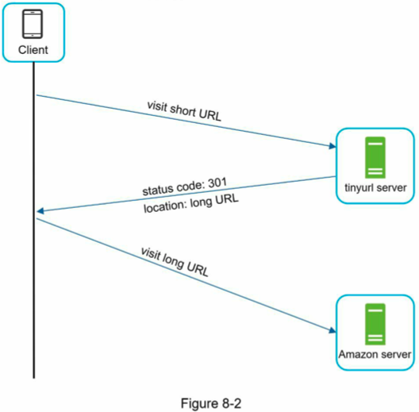
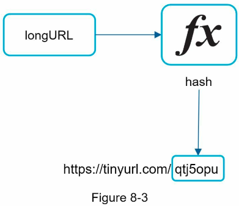
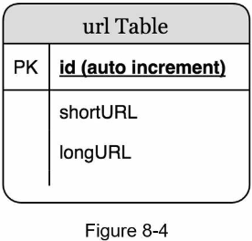
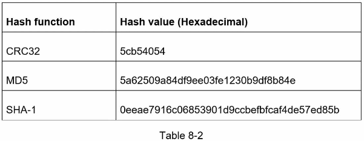
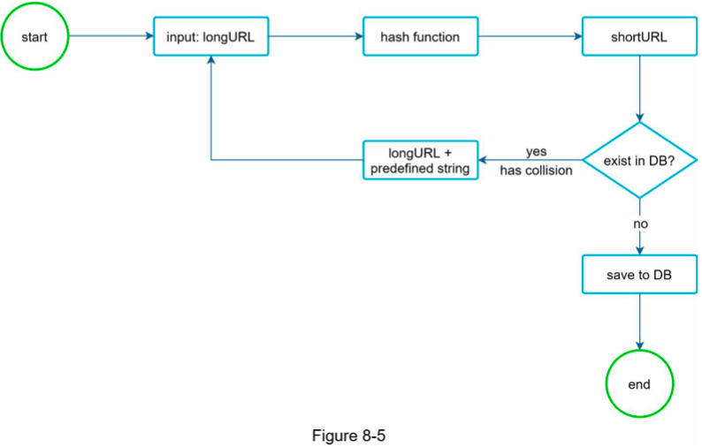
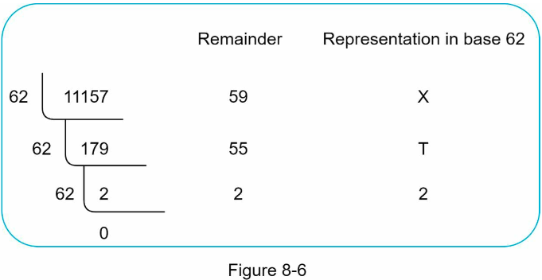
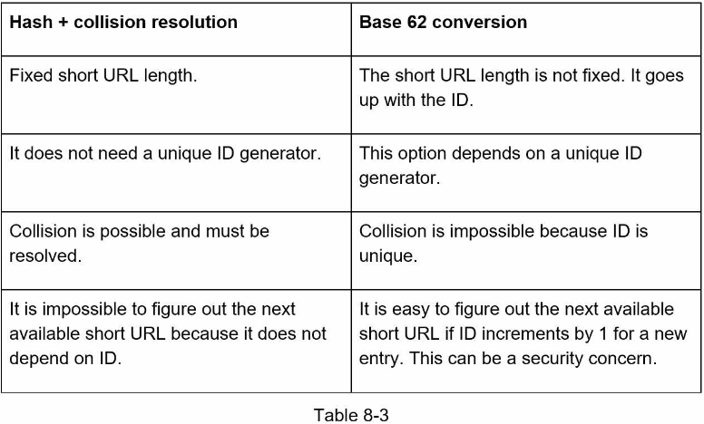
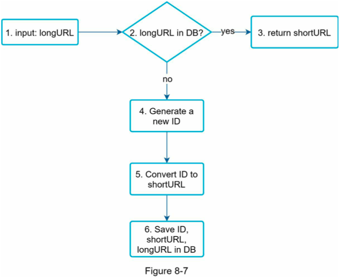
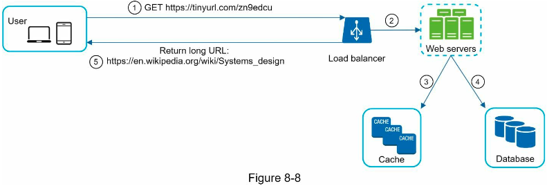

# Chapter 8: Design a URL Shortener
> ### *Design a URL shortening service like tinyurl*
<br>

## Step 1 - Understand the problem and establish design scope

<details>
<summary>Ask for an example of how a URL shortener works</summary>

  - Assume a long URL `https://www.systeminterview.com/q=chatsystem&c=loggedin&v=v3&l=long`

  - The URL service creates an alias with shorter length: `https://tinyurl.com/ y7keocwj`

  - Clicking the alias (short URL) redirects you to the original (long) URL
</details>

<details>
<summary>Ask for traffic volume</summary>

  - 100 mil URLs are generated per day
</details>

<details>
<summary>Ask for constraints; How long is the shortened URL?</summary>

  - As short as possible
</details>

<details>
<summary>Ask for constraints; What characters are allowed in the shortened URL?</summary>

  - Shortened URL can be a combination of numbers (0-9) and characters (a-z, A- Z)
</details>

<details>
<summary>Ask for constraints; Can shortened URLs be deleted or updated?</summary>

  - For simplicity, let us assume shortened URLs cannot be deleted or updated

  - Here are the basic use cases:
    1. URL shortening: given a long URL => return a much shorter URL
    2. URL redirecting: given a shorter URL => redirect to the original URL 
    3. High availability, scalability, and fault tolerance considerations
</details>

<br>

## Back of the enevlope estimation
- Write operation: **100 mil URLs/day**
- Write operation per second: **100 mil / 24 / 3600 = 1160**
  - where 24 is hours in a day and 3600 seconds in an hour
- Read operation: assuming ratio of read operation to write operation is **10:1**
- Read operation per second: **1160 * 10 = 11,600**
- Assuming the URL shortener service will run for 10 years, this means we must support **100 mil * 365 * 10 = 365 billion records**
  - where 365 is days in a year
- Assume **average URL length is 100**
- Storage requirement over 10 years: **365 billion * 100 bytes * 10 years = 365 TB**

## Step 2: Propose high-level design and get buy-in
### **API endpoints**
*facilitate communication between clients and servers*

A URL shortener primary needs two API endpoints
  <details>
  <summary>1. URL shortening</summary>
    To create a new short URL, a client sends a POST request which contains one parameter: the original long URL. The API looks like this:

    POST api/v1/data/shorten
      - request parameter: {longUrl: longURLString} 
      - return shortURL
  </details>

  <details>
  <summary>2. URL redirecting</summary>
    To redirect a short URL to the corresponding long URL, a client sends a GET request. The API looks like this:

    GET api/v1/shortUrl
      - return longURL for HTTP redirection
  </details>

<br>

### **URL redirecting**
- once the server receives a tinyurl request, it changes the short URL to the long URL with **301 redirect**

<details>
<summary>Request Headers:</summary>

```
  Request URL: https://tinyurl.com/qtj5opu
  Request Method: GET
  Status Code: 301
  ...
```
</details>

<details>
<summary>Response Headers:</summary>

```
  ...
  location: https://www.amazon.com/dp/laksjdfklsajdflksjdfklasjdflkjsdl
```
</details>
<br>
Steps:

1. Client visits short URL
2. tinyurl Server sends status code: 301 with location of long URL
3. Client visits the long URL and hits the amazon Server

<details>
<summary>Visual Process</summary>


</details>
<br>

#### **301 vs 302 redirect**
<details>
<summary>301 redirect</summary>

- requested URL is "permanently" moved to the long URL
- browser caches response and subsequent requests for the same URL will not be sent to the URL shortening service
- instead, requests are redirected to the long URL server directly
- *use case: when priority is to reduce server load, as only the first request of the same URL is sent to the shortening service*
</details>

<details>
<summary>302 redirect</summary>

- requested URL is "temporarily" moved to the long URL
- subsequent requests **will** be sent to the URL shortening server first
- then redirected to long URl server
- *use case: if analytics is important, as it can track click rate and source of the click more easily*
</details>

<br>

#### Possible implementation for URL redirecting:
Most intuitive way to implement URL redirecting is to use hash tables.
Assuming the hash table stores `<shortURL, longURL>` pairs, URL redirecting can be implemented by the following:
 - Get longURL: longURL = `hashTable.get(shortURL)`
 - Once you get the longURL, perform the URL redirect.

 ### **URL shortening**
Assume the sort URL looks like: `www.tinyurl.com/{hashValue}`
To support the URL shortening use case, find a hash function (fx) that maps a long URL to the *hashValue* 

<details>
<summary>Hash function visual:</summary>


</details>
<br>

The hash function must satisify the following requirements:
- each *longURL* must be hashed to one *hashValue*
- each *hashValue* can be mapped back to the *longURL*

## Step 3: Design deep dive

### **Data model**
- in the above, high level-design, everything is stored in a hash table
- good starting point, but not feasible for real-world systems
  - memory resources are limited and expensive
- better option: store `<shortURL, longURL>` mapping in a relational database
  - a simplified version of a table:
    - 3 columns: `id (auto increment)`, `shortURL`, `longURL`
    - <details>
      <summary>Table</summary>

      
      </details>
      <br>


### **Hash function**
*used to hash a long URL to a short URL, aka **hashValue***

**Hash value length**
- *hashValue* consists of characters from [0-9, a-z, A-Z] (gotten from our clarifications), containing 10 + 26 + 26 = **62 possible characters**
- to get the length, find the smallest *n* such that 62^n >= 365 billion URLs (gotten from back of the envelope est)

<details>
<summary>Maximal number of URLs</summary>

| N | Maximal number of URLs|
| - | --------------------- |
| 1 | 62^1 = 62
| 2 | 62^2 = 3,844
| 3 | 62^3 = 238,328
| 4 | 62^4 = 14,776,336
| 5 | 62^5 = 916,132,832
| 6 | 62^6 = 56,800,235,584
| 7 | 62^7 = 3,521,614,606,208 = ~3.5 trillion

3.5 trillion is more than enough to hold 365 billion URLs, so length of *hashValue* is **7**
</details>

<br>

#### **Two types of Hash functions for a URL shortener**
*Shorten a long URL to a 7-character string*

**hash + collision resolution**

A straightforward solution is to use [well-known hash functions](https://en.wikipedia.org/wiki/Systems_design) like CRC32, MD5, or SHA-1
- <details>
    <summary>hash results</summary>

    
    </details>
    <br>

All hash results are more than 7 chars long. 
A method to make it shorter:
- collect first 7 chars of a hash value
  - but this can lead to **hash collisions**
- to resolve hash collisions, we can recursively append a new predefined string until no more collision is discovered:
  - <details>
    <summary>proccess</summary>

    

    - can eliminate collision
    - but it is expensive to query the DB to check if a shortURL exists for every request
    - a technique called 'bloom filters' can improve performance
    - a [bloom filter](https://en.wikipedia.org/wiki/Bloom_filter) is a space-efficient probabilistic technique to test if an element is a member of a set
    </details>
    <br>

**Base 62 conversion**

*Base conversion is another commonly used approach for URL shorteners*
- helps to convert the same number between its different number representation systems
- we use base 62 conversion since there are 62 possible chars for *hashValue* 

<details>
<summary>Example: Convert 11157 base 10 to base 62</summary>

- From its name, base 62 is a way of using 62 characters for encoding. The mappings are: 0-0, ..., 9-9, 10-a, 11-b, ..., 35-z, 36-A, ..., 61-Z, where ‘a’ stands for 10, ‘Z’ stands for 61, etc.
- 1115710 =2x622 +55x621+59x620 =[2,55,59]->[2,T,X]inbase62 representation. 
- process:
  
</details>

<details>
<summary>Comparison of the two approaches</summary>
  
  
</details>
<br>

### **URL shortening deep dive**
- since this is one of the core pieces of the system, the URL shortening flow should be logically simple and functional
- we use base 62 conversion

Steps:
1. longURL is the input
2. the system checks if the longURL is in the DB
3. if it is, it means the longURL was converted to shortURL before; so fetch the shortURL from the DB and return it to the client
4. if not, the longURL is new; a new uniqueID (primary key) is generated by the unique ID generator
5. convert the ID to shortURL with base 62 conversion
6. create a new DB row with the ID, shortURL, and longURL

<details>
<summary>Visual diagram</summary>


</details>

<details>
<summary>Concrete example</summary>

- Assuming the input longURL is: `https://en.wikipedia.org/wiki/Systems_design` 
- Unique ID generator returns ID: `2009215674938`
- Convert the ID to shortURL using the base 62 conversion. ID (2009215674938) is converted to “zn9edcu”.
- Save ID, shortURL, and longURL to the database
    | id | shortURL | longURL
    | -- | -------- | ----
    | 2009215674938 | zn9edcu | https://en.wikipedia.org/wiki/Systems_design

- the primary function of the distributed unique ID generator is to generate globally unique IDs, which are used for creating shortURLs
- in a highly distributed environment, implementing a unique ID generator is challenging
  - check ch7 for a few solutions
</details>
<br>

### **URL redirecting deep dive**
- since there are more reads than writes `<shortURL, longURL>` mapping is stored in a cache to improve performance

Steps of URL redirecting:
1. a user clicks a short URL link: `https://tinyurl.com/zn9edcu`
2. the load balancer forwards the request to web servers
3. if a shortURL is already in the cache, return the longURL directly
4. if a shortURL is not in the cache, fetch the longURL from the DB; if it's not in the DB, it's likely a user entered an invalid shortURL
5. the longURL is returned to the user

<details>
<summary>Detailed design diagram</summary>


</details>
<br>

## Step 4: Wrap up
If there is extra time at the end of the interview, here are a few additional talking points:

- rate limiter: 
  - a potential secruty problem we could face is that malicious users send an overwhelming large number of URL shortening requests
  - rate limiter helps to filter out requests based on IP address or other filtering rules
  - ch4 for review about rate limiting
- web server scaling: 
  - since the web tier is stateless, it's easy to scale the web tier by adding or removing web servers
- database scaling:
  - database replication and sharding are common techniques
- analytics:
  - data is increasingly important for business success
  - integrating an analytics solution to the URL shortener could help to answer important questions like how many people click on a link? when do they click the link? etc
- availability, consistency, and reliability
  - these concepts are the core of any large system's success
  - ch1 for review on these three topics